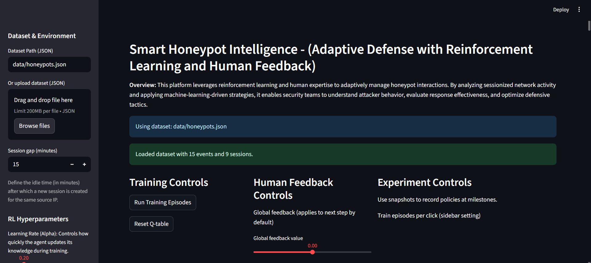
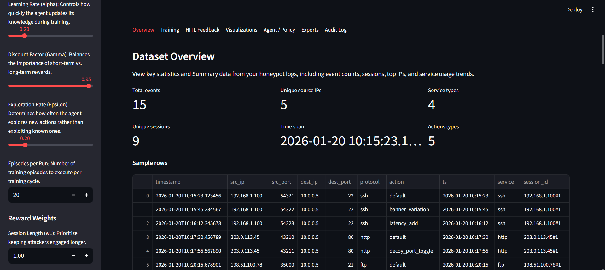
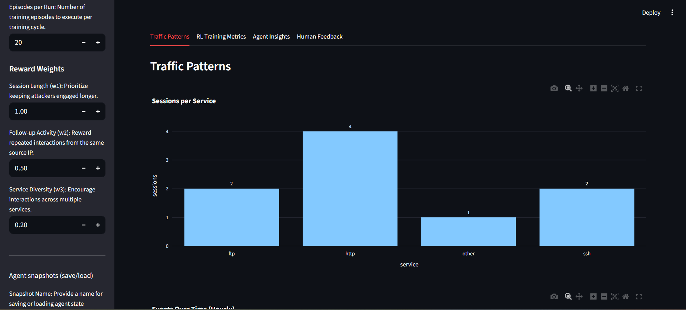
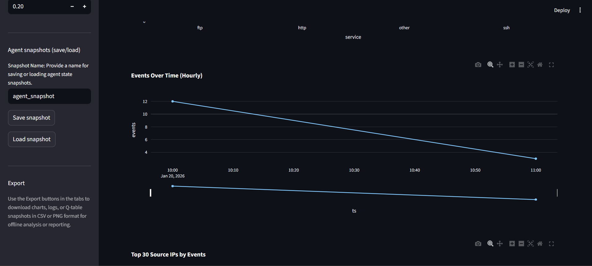
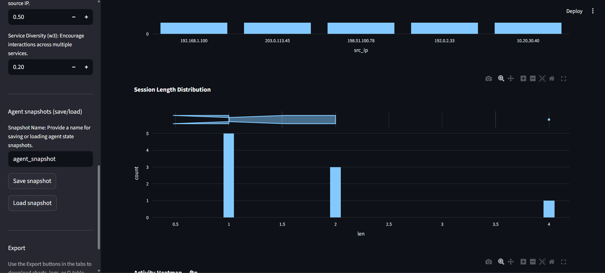

# Smart Honeypot Intelligence

AI-powered smart honeypot research project using reinforcement learning, Q-learning, and human-in-the-loop feedback for adaptive cyber deception.

This repository is the software and book companion package for **Smart Honeypot System Using Reinforcement Learning and Human Feedback**. It contains a Streamlit prototype, sample honeypot traffic data, screenshots, and supporting documentation for reproducing the core research workflow.

## Screenshots







## Overview

Smart Honeypot Intelligence models honeypot interactions as sessionized episodes and trains a tabular Q-learning agent to choose adaptive deception actions. The system supports analyst feedback, reward tuning, Q-table inspection, traffic visualization, and exportable experiment artifacts.

## Key Features

- **Adaptive cyber deception:** Uses Q-learning to adapt honeypot response behavior.
- **Human-in-the-loop feedback:** Allows analysts to apply reward feedback and annotate training runs.
- **Session analysis:** Groups honeypot events by source IP and configurable idle timeout.
- **Interactive dashboard:** Provides Streamlit views for training, monitoring, policy inspection, and exports.
- **Book companion docs:** Includes documentation for readers who want to reproduce or extend the research workflow.

## Architecture

### Core Components

1. **Reinforcement Learning Agent:** Tabular Q-learning agent that learns state-action values.
2. **Environment:** Simulates honeypot interactions from sessionized traffic logs.
3. **State Space:** Uses service type, traffic intensity, and recency buckets.
4. **Action Space:**
   - `default`: Standard honeypot behavior.
   - `banner_variation`: Modify service banners.
   - `latency_add`: Introduce artificial delays.
   - `decoy_port_toggle`: Enable or disable decoy ports.
   - `error_style_flip`: Alter error-message style.

### Reward Structure

The reward function combines:

- **Session Length (`w1`):** Rewards keeping attackers engaged longer.
- **Follow-up Activity (`w2`):** Encourages repeated interactions.
- **Service Diversity (`w3`):** Rewards interaction across multiple services.

## Installation

### Requirements

- Python 3.8+ (Python 3.11 recommended)
- Dependencies listed in `requirements.txt`

### Setup

```bash
git clone https://github.com/jao399/smart-honeypot-intelligence.git
cd smart-honeypot-intelligence
python -m pip install -r requirements.txt
```

On Linux or macOS, you can also run:

```bash
chmod +x setup.sh
./setup.sh
```

On Windows:

```bat
setup.bat
```

## Usage

Run the Streamlit app:

```bash
streamlit run app.py
```

The app opens at `http://localhost:8501`.

## Data Format

Place honeypot logs in `data/honeypots.json`. The loader accepts a JSON array or newline-delimited JSON (NDJSON).

Required fields:

- `timestamp`: ISO 8601 timestamp
- `src_ip`: Source IP address
- `dest_ip`: Destination IP address
- `src_port`: Source port number
- `dest_port`: Destination port number
- `protocol`: Protocol name, such as `ssh`, `http`, `https`, or `ftp`
- `action`: Honeypot action label

Example:

```json
[
  {
    "timestamp": "2026-01-20T10:15:23.123456",
    "src_ip": "192.168.1.100",
    "dest_ip": "10.0.0.5",
    "src_port": 54321,
    "dest_port": 22,
    "protocol": "ssh",
    "action": "default"
  }
]
```

## Project Structure

```text
smart-honeypot-intelligence/
|-- app.py
|-- requirements.txt
|-- setup.sh
|-- setup.bat
|-- data/
|   `-- honeypots.json
|-- docs/
|   |-- README.md
|   |-- experiment-guide.md
|   `-- dataset-format.md
|-- screenshots/
|   |-- sample1.png
|   |-- sample2.png
|   |-- sample3.png
|   |-- sample4.png
|   `-- sample5.png
|-- CITATION.cff
|-- CHANGELOG.md
|-- LICENSE
`-- README.md
```

## Book Companion Material

The `docs/` folder contains companion notes for readers of **Smart Honeypot System Using Reinforcement Learning and Human Feedback**:

- [Book companion index](docs/README.md)
- [Experiment guide](docs/experiment-guide.md)
- [Dataset format](docs/dataset-format.md)

## Research Scope

This project is a research prototype. It demonstrates how reinforcement learning and analyst feedback can be combined with honeypot telemetry to explore adaptive deception workflows. It is not a production intrusion detection system and should only be deployed in authorized lab or research environments.

## Citation

If you use this project in academic work, cite it using the metadata in [CITATION.cff](CITATION.cff).

## License

This project is licensed under the MIT License. See [LICENSE](LICENSE) for details.

## Acknowledgments

Built with Streamlit, NumPy, Pandas, Plotly, Matplotlib, and Seaborn.
